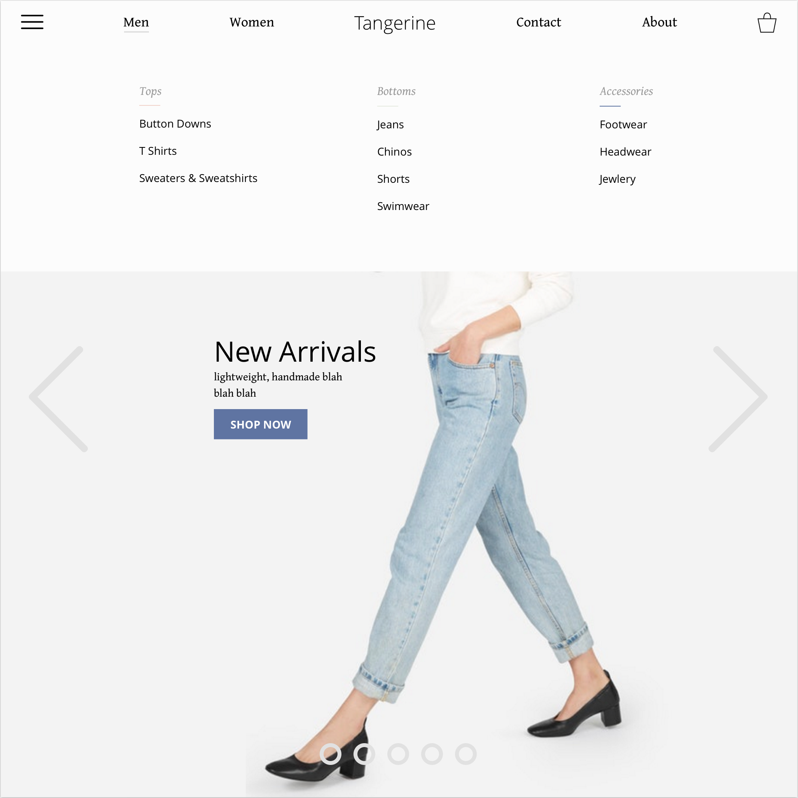

# _Brendan Hanna's UI/UX Projects_

### _Here is a glimpse into some of the work I've done in interface and experience design._

## Tangerine
### UI design for a fictional clothing company using Sketch

Drawing inspiration from existing online retailers, I created a clean, minimal and untuitive interface I would want to use as an online shopper.

## Invision Prototypes
### Interactive prototypes you can click through, made using Sketch with Invision's Craft plugin.

#### Non Profit Donation Manager
##### Mobile layout of a web app for managing recurring donations to non profits.  Users can search non profits organizations, add NPOs they're interested in or donating to to their personal list where they can manage donations, and interact with NPOs and other users through a social media micro-platform.

view invision prototype: https://invis.io/WUD1W108C

#### MemeSpace
##### 2-day design sprint with another Epicodus student.  A social media network where literally the only way to communicate is with memes.

Based on user input from fellow Epicodus students that craved a social media platform without any of that pesky human interaction to get in the way of cat pictures.

view invision prototype: https://invis.io/WUD1W108C

**_contact Brendan Hanna at gepetto503@gmail.com_**
